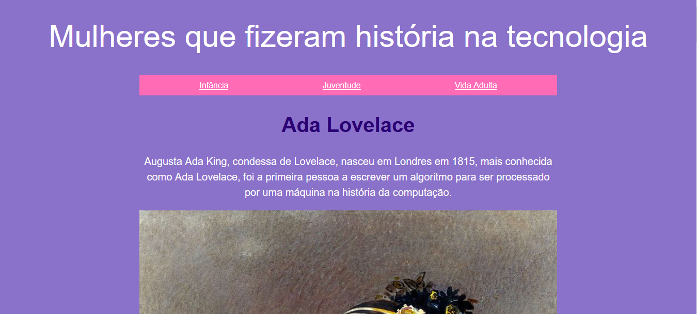

# 👩‍💻 Site: Ada Lovelace

Este repositório contém um site informativo dedicado à vida e legado de **Ada Lovelace**, considerada a primeira programadora da história. O projeto foi desenvolvido utilizando HTML, CSS e JavaScript, com o objetivo de fornecer uma experiência interativa e educativa sobre essa figura histórica.

📍 **Acesse o site publicado aqui:**  
➡️ [https://alinepax.github.io/site-ada-lovelace/](https://alinepax.github.io/site-ada-lovelace/)

---

## 📂 Estrutura do Projeto

```
siteada/
├── css/
│   └── style.css        # Estilos da página
├── img/
│   ├── adaPintura.png   # Imagem ilustrativa de Ada
│   ├── adaCrianca.png   # Imagem da infância de Ada
│   ├── adaTabela.png    # Tabela com algoritmo
│   └── preview.png      # Print do site
├── js/
│   └── script.js        # Script JavaScript
├── index.html           # Página principal do site
└── README.md            # Documentação do projeto
```

---

## 🎯 Funcionalidades do Site

- **Biografia de Ada Lovelace**: Informações detalhadas sobre sua infância, juventude e vida adulta.
- **Linha do Tempo**: Destaque cronológico dos principais eventos da vida de Ada.
- **Galeria de Imagens**: Representações visuais de momentos marcantes.
- **Links para Outras Mulheres na Tecnologia**: Referências a pioneiras como Grace Hopper, Dorothy Vaughan, Margaret Hamilton e Katherine Johnson.
- **Formulário de Contato**: Para visitantes interessados em receber mais informações.
- **Design Responsivo**: Layout adaptável para diferentes dispositivos, proporcionando uma experiência consistente em desktops, tablets e smartphones.  

---

## 🛠️ Tecnologias Utilizadas

- **HTML5**: Estruturação do conteúdo.
- **CSS3**: Estilização e layout.
- **JavaScript**: Interatividade e funcionalidades dinâmicas.

---

## 📸 Prévia do Site



*Nota: Para visualizar todas as funcionalidades e interatividades, acesse o site diretamente.*

---

## 🚀 Como Executar o Projeto

1. **Clone o repositório**:
   ```bash
   git clone https://github.com/seu-usuario/site-ada-lovelace.git
   ```

2. **Acesse o diretório do projeto**:
   ```bash
   cd site-ada-lovelace
   ```

3. **Abra o arquivo `index.html`** no seu navegador preferido.

---

## 📄 Licença

Este projeto está sob a licença MIT. Sinta-se à vontade para utilizá-lo, modificá-lo e distribuí-lo conforme as condições da licença.

---

## 🤝 Contribuições

Contribuições são bem-vindas! Se você deseja melhorar este projeto ou adicionar novas funcionalidades, siga os passos abaixo:

1. **Faça um fork** deste repositório.
2. **Crie uma branch** para a sua feature:
   ```bash
   git checkout -b minha-nova-feature
   ```
3. **Commit suas alterações**:
   ```bash
   git commit -m 'Adiciona nova funcionalidade'
   ```
4. **Faça o push** para a branch:
   ```bash
   git push origin minha-nova-feature
   ```
5. **Abra um Pull Request**.

---

## 👩‍💻 Sobre a Autora

Desenvolvido por **[Aline Paz](https://github.com/alinepax)**  
📫 Me encontre no [LinkedIn](https://www.linkedin.com/in/alinedapaz/)  
📧 Meu email: aline.santospaz@gmail.com  
🎯 Este projeto faz parte do meu portfólio como profissional em transição para a área de Dados e Tecnologia.

---

⭐ Se você gostou, deixe uma estrela no repositório!
